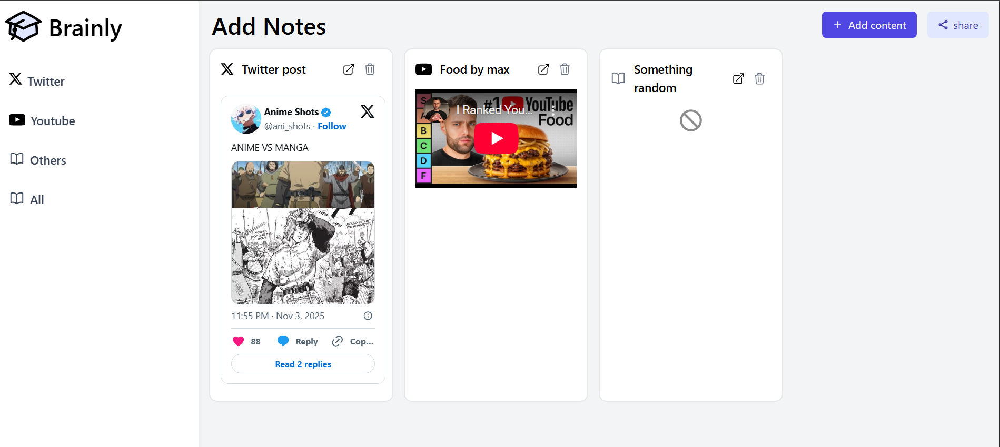
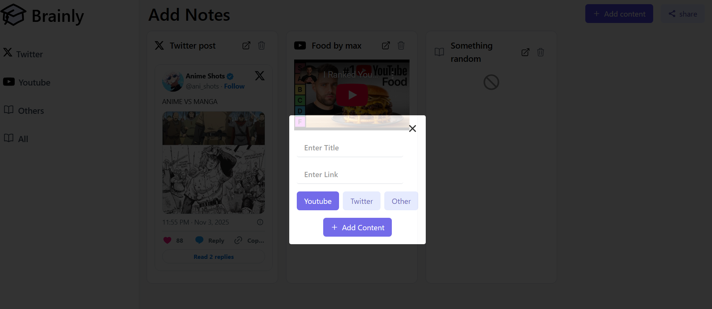
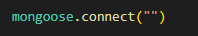
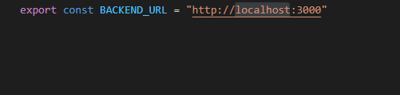
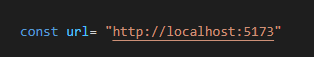

# 🧠 Brainly
A personal knowledge management app that lets you store, organize, and browse random URLs like a second brain. Share your curated collections with others and build your digital knowledge repository.

## ✨ Features

- 📌 **URL Storage**: Save and organize links from across the web
- 🔍 **Easy Browsing**: Navigate through your saved content effortlessly
- 🤝 **Sharing**: Share your brain (collections) with others
- 🎨 **Clean UI**: Intuitive interface for seamless experience
- 🚀 **Demo Mode**: Try it out without database setup

## 🖥️ UI Preview





## 🚀 Getting Started


### Installation & Setup

#### 1. Frontend Setup

```bash
cd App
npm install
npm run dev
```

#### 2. Backend Setup

```bash
cd Server
npm install
npm run dev
```

#### 3. Access the App

Visit `http://localhost:{portnumber}/Dashboard` to see the **demo version** without database configuration.

## ⚙️ Configuration

### Database Setup (Optional)

To use your own MongoDB database:

1. **Configure MongoDB Connection**
   - Open `Server/src/db.ts`
   - Paste your MongoDB connection string



2. **Configure Backend Port**
   - Open `App/src/config.ts`
   - Ensure the port in the connection string matches your backend localhost port



3. **Configure Frontend Port**
   - Open `App/src/pages/Dashboard.tsx`
   - Set the port to match your frontend localhost port



## 🛠️ Tech Stack

- **Frontend**: React/TypeScript
- **Backend**: Node.js/Express
- **Database**: MongoDB
